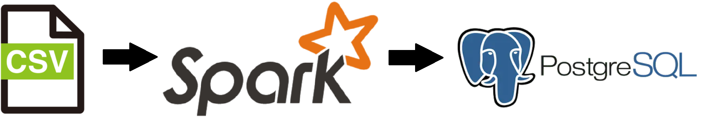
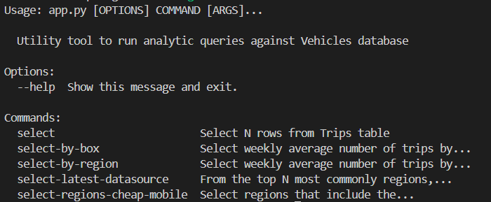
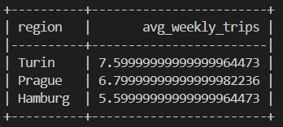
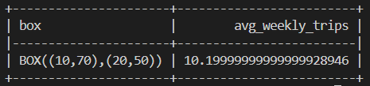
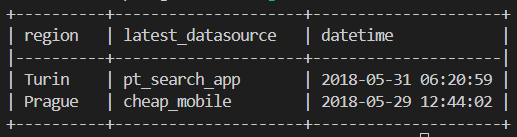
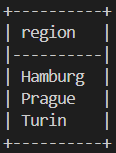
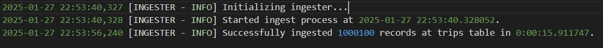

# Vehicles Data Ingester

This project aims to automate the ingestion process of vehicles trips data into an SQL database, as well as run analytical queries against the ingested data.

## Pipeline Architecture

The solution uses Apache Spark™ to process CSV files stored in a particular folder. All treated data is saved in a PostgreSQL database. 

Both Apache Spark™ and PostgreSQL were deployed into Docker containers.    

## Configuration

In order to execute the application, you should configure an `.env` file with the following attributes:

- **POSTGRES_HOST**: The PostgreSQL database hostname.
- **POSTGRES_PORT**: The port where the database is listening for clients.
- **POSTGRES_USER**: Database user name.
- **POSTGRES_PASSWORD**: Database user password.
- **POSTGRES_DB**: A database name.
- **TRIPS_TABLE**: The destination table for data upload (Should be `trips`).

You can find `.env` example in [.env.example](.env.example).

## Source Data

All CSV source files should be saved in the [data/](data/) directory. The application will try to process all files with `.csv` extension.

Also, make sure all files adhere to the same format as the [data/trips.csv](data/trips.csv) sample file.

## Starting Application

To start the application, run the following command.

`docker-compose up -d`

The above command will trigger an ingestion process, but you can also manually start it as many times as you want by running:

`docker-compose run --rm spark`

You can read log information about the ingestion process in the log files saved in the [log/](log/) folder.

To stop all running containers, run:

`docker-compose down`

*(PS: Once you stop the application, all ingested data will be lost!)*

## Data analysis

To get insight information about the trips data, you can use the analytics tool.

`docker-compose run --rm analytics python app.py --help`

To get the average number of trips by region, run the following example command.

`docker-compose run --rm analytics python app.py select-by-region`

To get the average number of trips by bounding box, run the following example command.

`docker-compose run --rm analytics python app.py select-by-box --box "(10,70),(20,50)"`

To get the latest datasource from the top N most commonly appearing regions, the command is:

`docker-compose run --rm analytics python app.py select-latest-datasource -n 2`

To get regions the `cheap_mobile` datasource appeared in, run:

`docker-compose run --rm analytics python app.py select-regions-cheap-mobile`

*(PS: All queries related to above analysis can be found at [analytics/src/queries/](analytics/src/queries/))*

## Stress Test

In order to test the capacity of the application, you can use [data-generator](generator/data-generator.py) tool to create CSV files of varying sizes.

For example, to create a source data file with 1 million records, run the below command:

`python data-generator.py 1000000`

The final file will be saved at [data/](data/) with a random name.

We can demonstrate the process's capacity by running the ingestion process on a large file.

The following log reports that we were able to successfully ingest 1 million records in under **16 seconds** in a cluster with a single node.

Since we are using a distributed data processing technology (Apache Spark™), the application can be scaled up very easily by adding new nodes to the cluster.

## Cloud Deployment

Since we are using a containerized solution, we can use a cloud managed Kubernets service, such as Amazon Elastic Kubernetes Service (EKS). Additionally, we can adapt the application to run on an Amazon EMR cluster.

For the database, we can use a managed data warehouse service such as Amazon Redshift. Since Redshift is based on PostgreSQL, it shares similar features.

Also, we can use an AWS S3 bucket to store the source CSV files.